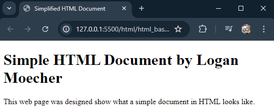

# HTML Elements

## Section Contains:

*Three Parts*:

1. Description and Examples of *HTML Elements*. 

2. Description and Examples of *Nested HTML Elements*

3. Descripiton and Examples of *Empty HTML Elements*

### HTML Elements

#### Element Description

* The *HTML Element* is everything from the "start tag" to the "end tag"
* *HTML* tags are not case sensitive "H" works the same as "h".

### HTML Document Example Explained

* The "*!DOCTYPE html*" declaration defines the document as an *HTML5* document.
* The "*html*" element is the root element for an *HTML* page.
* The "*head*" element contains meta information about the *HTML* document.
* The "*title*" element specifies a title for the *HTML* document (This is shown in the website tab or page).
* The "*body*" element defines the document's body. 
* The "*h1*" element defines a large heading.
* The "*p*" element defined a paragraph.

#### Example

* This is what a basic *HTML* document looks like before anything is truly done to it.
* The first "h1" is the start tag and the second "/h1" is the end tag.
* The "h1""/h1" and "p""/p" are examples of some HTML elements.

#### Output

### HTML Document using other Elements

#### HTML Document Example Explained

* The "*img*" element imbeds images into the *HTML* document.
* The "*h2*" element defines a large heading but not the largest.
* The "*h3*" element defines a medium sized font, smaller than "h1" and "h2". This continues between "h1" and "h6"

#### Example 

* This is what appears when using an "img file".
* This can all be restructured and improved visually through *CSS*.

### HTML Nested Elements

#### Nested Element Description

* The *HTML Nested Element* is when the elements can contain other elements. 
* There are *Nested Elements* in every HTML document. 

#### Example 

* This example contains six elements (html, head, title, body, h1, and p1).
* "html" is the root element which defines the entire HTML document. 
*  An "end tag" is needed on each for it to be displayed correctly

### HTML Empty Elements 

#### Empty Element Description

* This truly speaks for itself. An *Empty Element* is and element with no content. 

* The "br" tag is used to create a line break and is also known as an *Empty Element".
* You do not need an "end tag" for an empty element.

