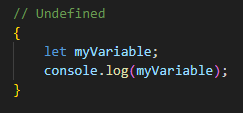
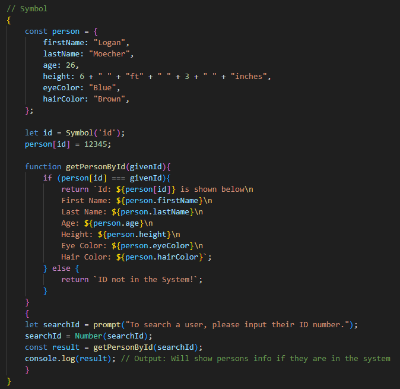
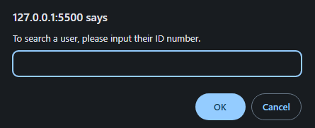
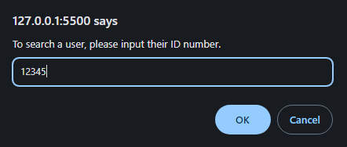
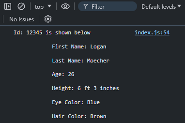
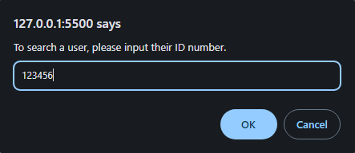

# Primitives / Value Types

## Section Contains:

*Eight Parts*:

1. The Decscription of *Primitives*/*Value Types* and why they are used.
2. Description and Examples of *Strings*
3. Description and Examples of *Numbers*
4. Description and Examples of *Booleans*
5. Description and Examples of *Undefined*
6. Description and Examples of *Null*
7. Description and Examples of *BigInt*
8. Description and Examples of *Symbols*

#### This file includes:

* Link to the *Primitives* / *Value Types* file: [Primitives / Value Types](primitives_value_types_code/index.js "Primitives / Value Types file")
* Screenshots of each *Value Type* application and the output

##### This image shows quick Descriptions of each that will be covered later in this section.

##### *HTML* code that was used for these application

# Primitives / Value Types Description:

* *Primitives*/*Value Types*: are basic data types that represent simple pieces of information
* These *Value Types* are:
> * String
> * Number
> * Boolean
> * Undefined
> * Null
> * BigInt
> * Symbol

# String

* *String*: This data type represents a sequence of characters. Strings are enclosed in single or double quotes. For example, “Hello World!” is a string.

### Example

### Output

##### *String* application running in the Browser Console

##### *String* application running in Command Prompt

# Number 

* *Number*: This data type represents a numerical value. It can be an integer or a floating-point number. For example, 5, 10.2, -3.5 are all numbers. Some numbers may not be represented accurately. This is due to rounding errors, which can be avoided by using "toFixed()" method to round the total.

### Example

### Output

##### *Number* application running in the Browser Console

##### *Number* application running in the Command Prompt

# Boolean

* *Boolean*: This data type represents a logical value, either true or false. (T/F can not be used as variables because they are reserved keywords)

### Example

### Output

##### *Boolean* application running in the Browser Console

##### *Boolean* application running in the Command Prompt

# Undefined

* *Undefined*: This data type represents a value that is not defined.

### Example

### Output

##### *Undefined* application running in the Browser Console

##### *Undefined* application running in the Command Prompt 

# Null

* *Null*: This data type represents a null or empty value.

### Example

### Output

##### *Null* application running in the Browser Console

##### *Null* application running in the Command Prompt

# BigInt

* *BigInt*: This data type represents integers that are larger than 2⁵³-1 or smaller than -(2⁵³-1). 

### Example

### Output

##### *BigInt* application running in the Browser Console

##### *BigInt* application running in the Command Prompt

# Symbol

* *Symbol*: This data type represents a unique value that cannot be duplicated. Often used as keys in objects to avoid naming issues

### Example

* A function was used to demonstrate a useful way to use symbols.

### Output

* Output is only displayed in Browser Console due to node not allowing the use of "prompt". There is a way to have user inputs in node, it just uses a different method. For this application I used "prompt".

##### *Symbol* application prompting the user for a user ID

##### *Symbol* application recieving user input as "12345" prompts the system to check for any users with that ID number.

##### *Symbol* application returns with a user because that specific ID number is in the sytem.

##### *Symbol* application recieving user input as "123456" prompts the system to check for any users with that ID number.

##### *Symbol* application returns with "ID not found in system!" because ID is not in the system.

